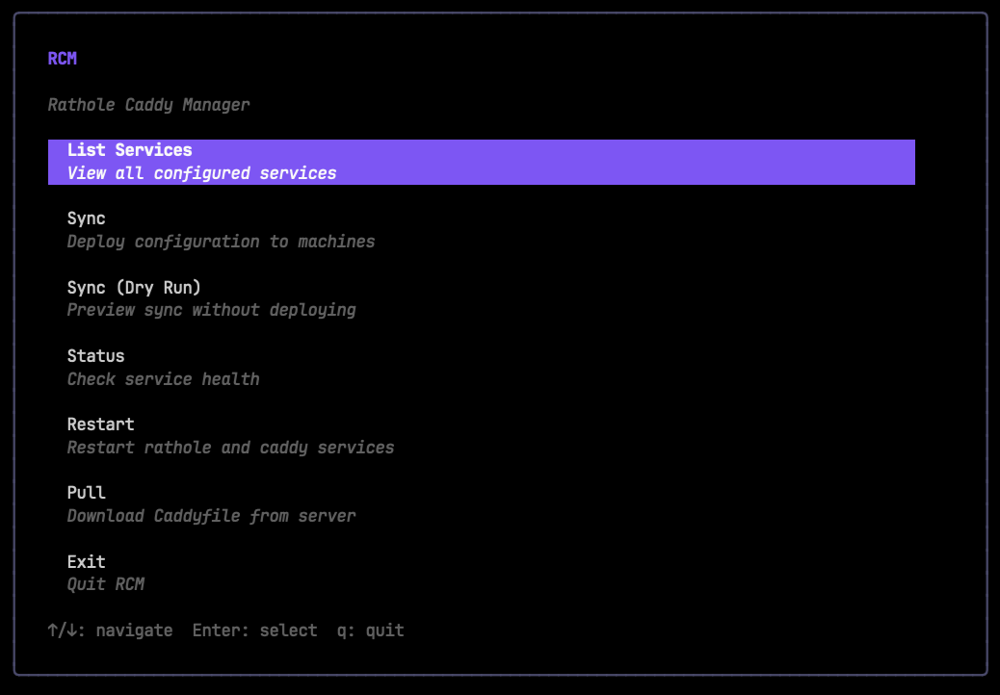
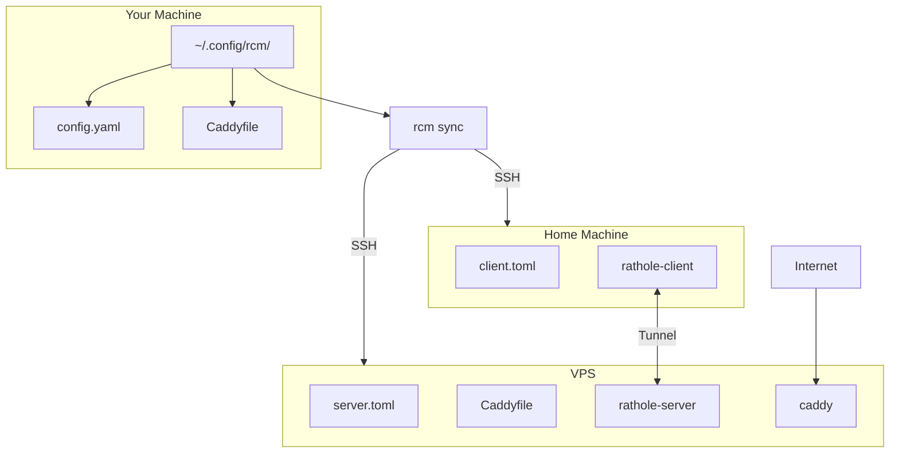

# RCM - Rathole Caddy Manager

A single-binary CLI tool with interactive TUI for managing [Rathole](https://github.com/rapiz1/rathole) tunnels with [Caddy](https://caddyserver.com/) reverse proxy. Uses your **Caddyfile as the single source of truth** - just edit one file and RCM handles the rest.



> **Prerequisites:** This tool requires a working Rathole + Caddy setup. See **[rathole-tunnel](https://github.com/AhmedAburady/rathole-tunnel)** for the complete setup guide.



## The Problem

When exposing home network services through a VPS using Rathole + Caddy, adding a new service requires editing **3 config files across 2 machines**:

1. `server.toml` on VPS (rathole server)
2. `client.toml` on home machine (rathole client)
3. `Caddyfile` on VPS (reverse proxy)

This is error-prone and tedious.

## The Solution

RCM lets you manage everything from a single Caddyfile:

```caddyfile
# myapp: 192.168.1.100:3000
app.example.com {
    reverse_proxy 127.0.0.1:5000 { ... }
}
```

Then just run:
```bash
rcm sync
```

RCM will:
1. Parse the Caddyfile to extract service definitions
2. Generate `server.toml` and `client.toml`
3. SSH to both machines and deploy the configs
4. Restart rathole and caddy services

## Features

- **Single Binary** - No dependencies, just download and run
- **Interactive TUI** - Beautiful terminal interface with keyboard navigation
- **Plain Mode** - Use `--plain` flag for scripting and CI/CD
- **Service Comparison** - See which services exist locally vs remotely
- **Auto-Pull** - Automatically pulls Caddyfile when setting up a new machine
- **Safe Sync** - Warns before removing services

## Installation

### Download Binary

Download the latest release for your platform from [Releases](https://github.com/AhmedAburady/rcm-go/releases):

```bash
# macOS (Apple Silicon)
curl -L https://github.com/AhmedAburady/rcm-go/releases/latest/download/rcm-darwin-arm64 -o rcm
chmod +x rcm
sudo mv rcm /usr/local/bin/

# macOS (Intel)
curl -L https://github.com/AhmedAburady/rcm-go/releases/latest/download/rcm-darwin-amd64 -o rcm
chmod +x rcm
sudo mv rcm /usr/local/bin/

# Linux (x86_64)
curl -L https://github.com/AhmedAburady/rcm-go/releases/latest/download/rcm-linux-amd64 -o rcm
chmod +x rcm
sudo mv rcm /usr/local/bin/
```

### Build from Source

Requires Go 1.21+:

```bash
git clone https://github.com/AhmedAburady/rcm-go.git
cd rcm-go
go build -o rcm ./cmd/rcm
sudo mv rcm /usr/local/bin/
```

## Configuration

### 1. Create config directory

```bash
mkdir -p ~/.config/rcm
```

### 2. Create config.yaml

```bash
nano ~/.config/rcm/config.yaml
```

```yaml
# Paths
paths:
  caddyfile: "~/.config/rcm/Caddyfile"
  ssh_dir: "~/.ssh"

# VPS (Server) SSH Configuration
server:
  host: "203.0.113.50"              # Your VPS IP
  user: "root"
  ssh_key: "id_ed25519"             # SSH key filename
  rathole_config: "/etc/rathole/server.toml"
  caddyfile: "~/rathole-caddy/caddy/Caddyfile"
  caddy_compose_dir: "~/rathole-caddy/caddy"

# Home (Client) SSH Configuration
client:
  host: "192.168.1.10"              # Home machine IP (or hostname)
  user: "pi"
  ssh_key: "id_ed25519"
  rathole_config: "/etc/rathole/client.toml"

# Rathole keys
rathole:
  bind_port: 2333
  token: "your-token-here"          # openssl rand -base64 32
  server_private_key: "..."         # From: rathole --genkey
  server_public_key: "..."          # From: rathole --genkey
```

### 3. Create your Caddyfile

Add a comment before each domain block to define the service:

```caddyfile
# service_name: local_ip:port
```

Example:
```caddyfile
# homeassistant: 192.168.1.10:8123
ha.example.com {
    tls /certs/cert.pem /certs/key.pem
    reverse_proxy 127.0.0.1:5001 {
        header_up Host {host}
        header_up X-Real-IP {remote_host}
        header_up X-Forwarded-For {remote_host}
        header_up X-Forwarded-Proto {scheme}
    }
}
```

The VPS port (`5001`) is extracted from `reverse_proxy 127.0.0.1:5001`.

## Usage

### Interactive TUI (Default)

Simply run any command to launch the interactive interface:

```bash
rcm              # Launch main menu
rcm list         # Service list view
rcm sync         # Sync view
rcm status       # Status view
rcm pull         # Pull view
rcm restart      # Restart view
```

**TUI Navigation:**
- `↑/↓` or `j/k` - Navigate
- `Enter` - Select
- `Esc` - Go back
- `q` - Quit

### Plain Text Mode

Use `--plain` or `-p` for non-interactive output:

```bash
rcm list --plain         # Plain text service list
rcm sync --plain         # Plain text sync output
rcm status --plain       # Plain text status
rcm pull --plain         # Plain text pull
rcm restart --plain      # Plain text restart
```

### Commands

| Command | Description |
|---------|-------------|
| `rcm` | Launch interactive TUI |
| `rcm list` | List services (local vs remote comparison) |
| `rcm pull` | Pull Caddyfile from VPS to local |
| `rcm sync` | Deploy configs to both machines |
| `rcm status` | Check service health on both machines |
| `rcm restart` | Restart rathole and caddy services |

### Restart Options

```bash
rcm restart              # Restart all services
rcm restart --server     # VPS only (rathole-server, caddy)
rcm restart --client     # Client only (rathole-client)
```

## Service Comparison

`rcm list` shows which services exist locally vs remotely:

```
┌─────────────────┬────────────────────┬──────────┬─────────────────┬───────┬────────┐
│ Service         │ Local Address      │ VPS Port │ Domains         │ Local │ Remote │
├─────────────────┼────────────────────┼──────────┼─────────────────┼───────┼────────┤
│ homeassistant   │ 192.168.1.10:8123  │ 5001     │ ha.example.com  │ ✓     │ ✓      │
│ newservice      │ 192.168.1.50:3000  │ 5002     │ new.example.com │ ✓     │ ✗      │
└─────────────────┴────────────────────┴──────────┴─────────────────┴───────┴────────┘
```

## Workflow

1. **First time?** Run `rcm pull` to get the remote Caddyfile
2. **Edit your local Caddyfile** - add/remove service blocks with comments
3. **Run `rcm sync`** - deploys everything automatically
4. **Done!**

## Caddyfile Format Reference

### Basic service
```caddyfile
# servicename: 192.168.1.100:8080
domain.com {
    reverse_proxy 127.0.0.1:5000 { ... }
}
```

### HTTPS backend (self-signed certs)
```caddyfile
# portainer: 192.168.1.50:9443
portainer.example.com {
    reverse_proxy https://127.0.0.1:5002 {
        transport http {
            tls_insecure_skip_verify
        }
        ...
    }
}
```

### Multiple domains, same service
```caddyfile
# blog: 192.168.1.100:8080
blog.example.com {
    reverse_proxy 127.0.0.1:5003 { ... }
}

# blog: 192.168.1.100:8080
www.blog.example.com {
    reverse_proxy 127.0.0.1:5003 { ... }
}
```

Only one rathole tunnel is created - RCM deduplicates by service name.

## Building

```bash
# Build for current platform
go build -o rcm ./cmd/rcm

# Cross-compile
GOOS=linux GOARCH=amd64 go build -o rcm-linux-amd64 ./cmd/rcm
GOOS=darwin GOARCH=arm64 go build -o rcm-darwin-arm64 ./cmd/rcm
GOOS=darwin GOARCH=amd64 go build -o rcm-darwin-amd64 ./cmd/rcm
```

## License

MIT
