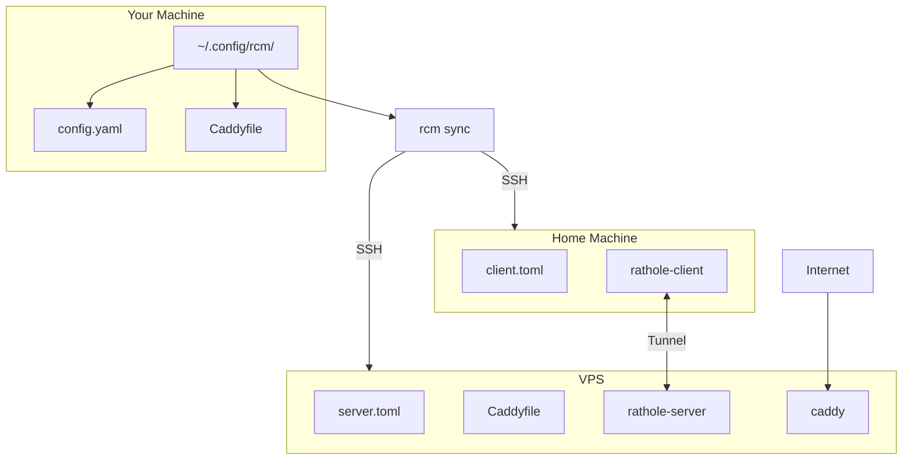

# RCM - Rathole Caddy Manager

A single-binary CLI tool for managing [Rathole](https://github.com/rapiz1/rathole) tunnels with [Caddy](https://caddyserver.com/) reverse proxy. Uses your **Caddyfile as the single source of truth** - just edit one file and RCM handles the rest.

> **Prerequisites:** This tool requires a working Rathole + Caddy setup. See **[rathole-tunnel](https://github.com/AhmedAburady/rathole-tunnel)** for the complete setup guide.


```mermaid
flowchart TB
    subgraph local["Your Machine"]
        config["~/.config/rcm/"]
        configyaml["config.yaml"]
        caddyfile["Caddyfile"]
        config --> configyaml
        config --> caddyfile
    end

    rcm["rcm sync"]
    config --> rcm

    subgraph vps["VPS"]
        servertoml["server.toml"]
        vpscaddy["Caddyfile"]
        ratholeserver["rathole-server"]
        caddy["caddy"]
    end

    subgraph home["Home Machine"]
        clienttoml["client.toml"]
        ratholeclient["rathole-client"]
    end

    rcm -->|SSH| vps
    rcm -->|SSH| home

    internet["Internet"] --> caddy
    ratholeclient <-->|Tunnel| ratholeserver
```

## The Problem

When exposing home network services through a VPS using Rathole + Caddy, adding a new service requires editing **3 config files across 2 machines**:

1. `server.toml` on VPS (rathole server)
2. `client.toml` on home machine (rathole client)
3. `Caddyfile` on VPS (reverse proxy)

This is error-prone and tedious.

## The Solution

RCM lets you manage everything from a single Caddyfile:

```caddyfile
# myapp: 192.168.1.100:3000
app.example.com {
    reverse_proxy 127.0.0.1:5000 { ... }
}
```

Then just run:
```bash
rcm sync
```

RCM will:
1. Parse the Caddyfile to extract service definitions
2. Generate `server.toml` and `client.toml`
3. SSH to both machines and deploy the configs
4. Restart rathole and caddy services

## Features

- **Single Binary** - No dependencies, just download and run
- **Flags-driven CLI** - Non-interactive output, scriptable for CI/CD
- **Sync Status** - `rcm list` compares your local Caddyfile against the VPS and flags per-service drift at a glance
- **Auto-Pull** - Automatically pulls Caddyfile when setting up a new machine
- **Safe Sync** - Warns before removing services
- **Flexible SSH Auth** - Use a key file or any SSH agent, including [1Password](https://developer.1password.com/docs/ssh/) (private key never touches disk)
- **Secret References** - Read config values from 1Password (`op://`) or environment variables (`${VAR}`)

## Installation

### Download Binary

Download the latest release for your platform from [Releases](https://github.com/AhmedAburady/rcm-go/releases):

```bash
# macOS (Apple Silicon)
curl -L https://github.com/AhmedAburady/rcm-go/releases/latest/download/rcm-darwin-arm64 -o rcm
chmod +x rcm
sudo mv rcm /usr/local/bin/

# macOS (Intel)
curl -L https://github.com/AhmedAburady/rcm-go/releases/latest/download/rcm-darwin-amd64 -o rcm
chmod +x rcm
sudo mv rcm /usr/local/bin/

# Linux (x86_64)
curl -L https://github.com/AhmedAburady/rcm-go/releases/latest/download/rcm-linux-amd64 -o rcm
chmod +x rcm
sudo mv rcm /usr/local/bin/
```

### Install with Go

If you have Go installed:

```bash
go install github.com/AhmedAburady/rcm-go/cmd/rcm@latest
```

### Build from Source

Requires Go 1.26+:

```bash
git clone https://github.com/AhmedAburady/rcm-go.git
cd rcm-go
go build -o rcm ./cmd/rcm
sudo mv rcm /usr/local/bin/
```

## Configuration

### 1. Create config directory

```bash
mkdir -p ~/.config/rcm
```

### 2. Create config.yaml

```bash
nano ~/.config/rcm/config.yaml
```

```yaml
# Paths
paths:
  caddyfile: "~/.config/rcm/Caddyfile"
  ssh_dir: "~/.ssh"

# VPS (Server) SSH Configuration
server:
  host: "203.0.113.50"              # Your VPS IP
  user: "root"
  ssh_key: "id_ed25519"             # SSH key filename (file-based auth)
  # ssh_agent: true                 # OR: authenticate via an SSH agent (e.g. 1Password)
  # ssh_agent_socket: "~/..."       # optional; defaults to $SSH_AUTH_SOCK
  rathole_config: "/etc/rathole/server.toml"
  caddyfile: "~/rathole-caddy/caddy/Caddyfile"
  caddy_compose_dir: "~/rathole-caddy/caddy"

# Home (Client) SSH Configuration
client:
  host: "192.168.1.10"              # Home machine IP (or hostname)
  user: "pi"
  ssh_key: "id_ed25519"             # or use ssh_agent: true (see server example)
  rathole_config: "/etc/rathole/client.toml"

# Rathole keys
rathole:
  bind_port: 2333
  token: "your-token-here"          # openssl rand -base64 32
  server_private_key: "..."         # From: rathole --genkey
  server_public_key: "..."          # From: rathole --genkey
```

### 3. Create your Caddyfile

Add a comment before each domain block to define the service:

```caddyfile
# service_name: local_ip:port
```

Example:
```caddyfile
# homeassistant: 192.168.1.10:8123
ha.example.com {
    tls /certs/cert.pem /certs/key.pem
    reverse_proxy 127.0.0.1:5001 {
        header_up Host {host}
        header_up X-Real-IP {remote_host}
        header_up X-Forwarded-For {remote_host}
        header_up X-Forwarded-Proto {scheme}
    }
}
```

The VPS port (`5001`) is extracted from `reverse_proxy 127.0.0.1:5001`.

## SSH Authentication

RCM connects to both machines over SSH. Each host (`server` and `client`) uses **one** of two authentication modes — set exactly one (setting both is rejected):

**File-based key** (default):
```yaml
ssh_key: "id_ed25519"   # a bare name resolves under paths.ssh_dir, or give a full path
```

**SSH agent** — works with any standard agent (OpenSSH `ssh-agent`, `gpg-agent`, **1Password**, Secretive, a YubiKey-backed agent, …). With 1Password the private key stays in the vault and never touches disk:
```yaml
ssh_agent: true
# ssh_agent_socket: "~/path/to/agent.sock"   # optional override
```

Socket resolution order: `ssh_agent_socket` → `$SSH_AUTH_SOCK` → 1Password's default socket on macOS. Set `ssh_agent_socket` only if your agent isn't already on `$SSH_AUTH_SOCK`.

> **1Password tip:** export `SSH_AUTH_SOCK` to the 1Password socket in your shell so every tool (including RCM) picks it up automatically:
> ```bash
> export SSH_AUTH_SOCK=~/Library/Group\ Containers/2BUA8C4S2C.com.1password/t/agent.sock
> ```

## Secret References

Any string value in `config.yaml` can be pulled from 1Password or the environment instead of being stored in plaintext:

```yaml
rathole:
  token: "op://Vault/rcm/token"           # 1Password (requires the `op` CLI)
  server_private_key: "${RATHOLE_KEY}"    # environment variable
```

Connectivity values (hosts, users, key paths) resolve at startup; the `rathole` secrets resolve only during `rcm sync`, so commands like `rcm status` never prompt for secrets they don't use.

## Usage

RCM is a flags-driven CLI: each command prints directly to the terminal. Run
`rcm` with no arguments (or `rcm --help`) to see the command list.

```bash
rcm list            # List services with local↔VPS sync status
rcm list --no-check # List instantly, offline (skip the SSH check)
rcm sync            # Generate configs and deploy to both machines
rcm sync --dry-run  # Preview what would deploy; change nothing
rcm status          # Check service health on both machines
rcm pull            # Pull the Caddyfile from the VPS to local
rcm restart         # Restart rathole and caddy services
```

### Commands

| Command | Description |
|---------|-------------|
| `rcm` | Show help and the command list |
| `rcm list` | List services with local↔VPS sync status (`--no-check` to skip the SSH probe) |
| `rcm pull` | Pull Caddyfile from VPS to local |
| `rcm sync` | Deploy configs to both machines (`--dry-run` to preview) |
| `rcm status` | Check service health on both machines |
| `rcm restart` | Restart rathole and caddy services |
| `rcm version` | Print version, commit, and build date |

### Restart Options

```bash
rcm restart              # Restart all services
rcm restart --server     # VPS only (rathole-server, caddy)
rcm restart --client     # Client only (rathole-client)
```

## Sync Status

By default `rcm list` connects to the VPS, downloads its Caddyfile, and compares it against your local Caddyfile — the single source of truth — service by service:

```
╭────┬───────────────┬───────────────────┬──────────┬─────────────────┬───────┬────────╮
│ #  │ SERVICE       │ LOCAL ADDRESS     │ VPS PORT │ DOMAINS         │ LOCAL │ REMOTE │
├────┼───────────────┼───────────────────┼──────────┼─────────────────┼───────┼────────┤
│ 1  │ homeassistant │ 192.168.1.10:8123 │ 5001     │ ha.example.com  │ ✓     │ ✓      │
│ 2  │ newservice    │ 192.168.1.50:3000 │ 5002     │ new.example.com │ ✓     │ ✗      │
╰────┴───────────────┴───────────────────┴──────────┴─────────────────┴───────┴────────╯
```

- **LOCAL** — `✓` the service is defined in your local Caddyfile, `✗` it exists only on the VPS
- **REMOTE** — `✓` present and identical on the VPS, `✗` missing/changed/orphaned (run `rcm sync`), `?` the VPS could not be reached

Above, `newservice` is defined locally but not yet deployed. The comparison uses `server.caddyfile` from your config; if it's unset or the VPS is unreachable, the REMOTE column shows `?` and the reason is printed below the table.

Skip the SSH probe for an instant, offline listing:

```bash
rcm list --no-check
```

## Workflow

1. **First time?** Run `rcm pull` to get the remote Caddyfile
2. **Edit your local Caddyfile** - add/remove service blocks with comments
3. **Run `rcm sync`** - deploys everything automatically
4. **Done!**

## Caddyfile Format Reference

### Basic service
```caddyfile
# servicename: 192.168.1.100:8080
domain.com {
    reverse_proxy 127.0.0.1:5000 { ... }
}
```

### HTTPS backend (self-signed certs)
```caddyfile
# portainer: 192.168.1.50:9443
portainer.example.com {
    reverse_proxy https://127.0.0.1:5002 {
        transport http {
            tls_insecure_skip_verify
        }
        ...
    }
}
```

### Multiple domains, same service
```caddyfile
# blog: 192.168.1.100:8080
blog.example.com {
    reverse_proxy 127.0.0.1:5003 { ... }
}

# blog: 192.168.1.100:8080
www.blog.example.com {
    reverse_proxy 127.0.0.1:5003 { ... }
}
```

Only one rathole tunnel is created - RCM deduplicates by service name.

## Building

```bash
# Build for current platform (or: just build)
go build -o rcm ./cmd/rcm

# Cross-compile
GOOS=linux GOARCH=amd64 go build -o rcm-linux-amd64 ./cmd/rcm
GOOS=darwin GOARCH=arm64 go build -o rcm-darwin-arm64 ./cmd/rcm
GOOS=darwin GOARCH=amd64 go build -o rcm-darwin-amd64 ./cmd/rcm
```

## License

MIT
